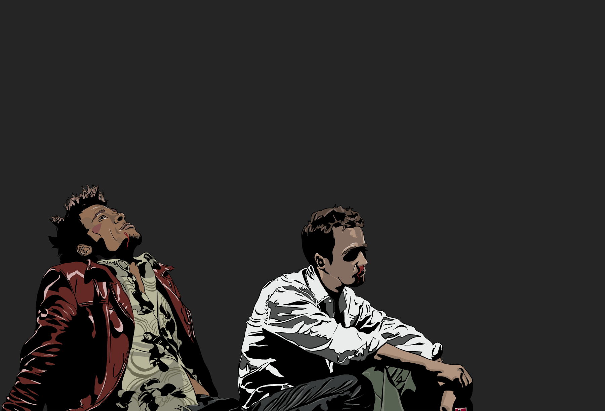
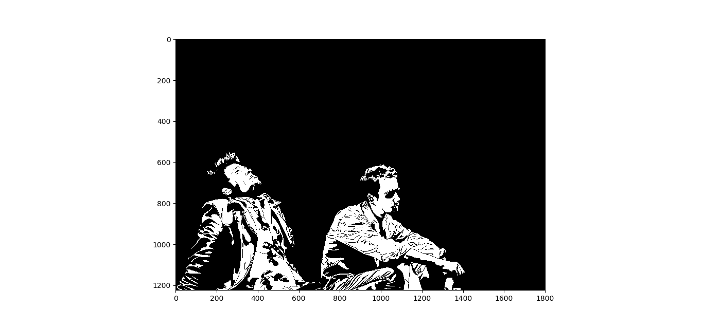

#### A simple program to convert a colour image to it's black and white equivalent

### Installation

* Install dependencies

```sh
$ pip3 intall -r requirements.txt
```

<br>

### Sample Input



<br>
<br>
<br>

### Sample Output



</div>